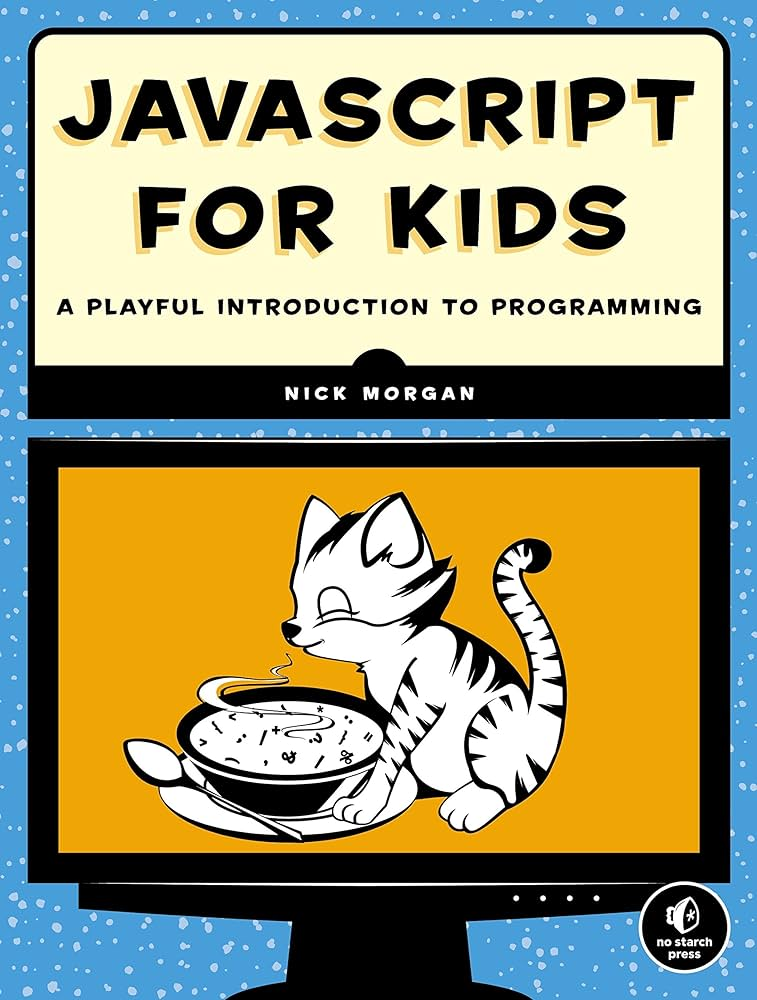

# Canvas Snake Game

Snake Game based on the book "Javascript for Kids", using canvas and written in typescript.

## pseudocode

```
/**
 * Set up the canvas
 * Set score to zero
 * Create snake
 * Create apple
 *
 * Every 100ms:
 * - Clear the canvas
 * - Draw current score on the screen
 * - Move the snake
 * If snake collides with wall or itself:
 * - End the game
 * Else if snake collides with apple:
 * - Increase score
 * - Create new apple
 * - Grow snake
 * For each segment of the snake:
 * - Draw the segment
 *
 * Draw the apple
 * Draw the border
 *
 * When the user presses a key:
 * - If the key is an arrow key:
 *  - Change the snake's direction
 */
```

;